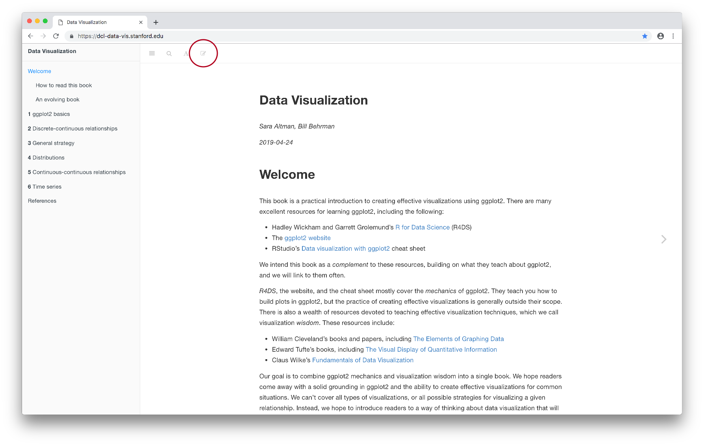
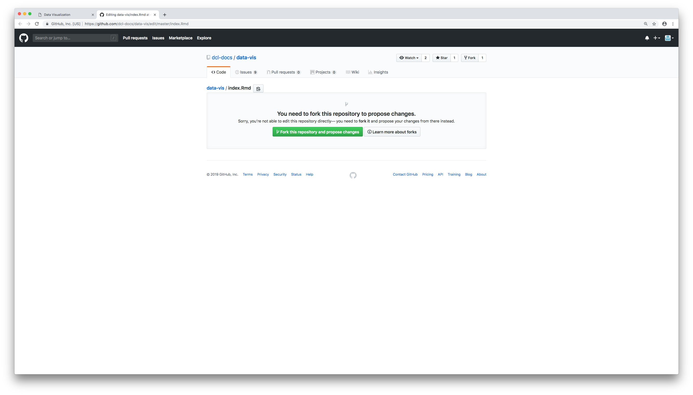
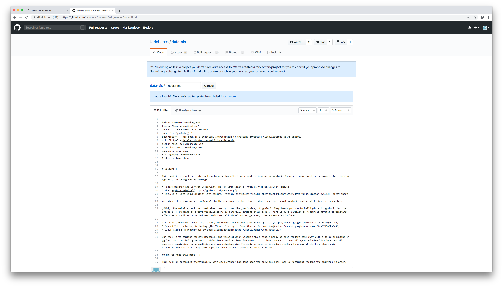
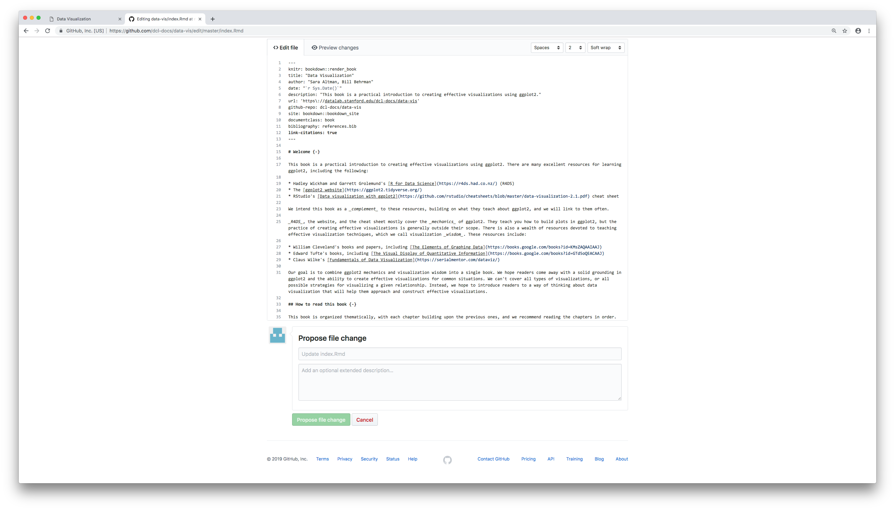
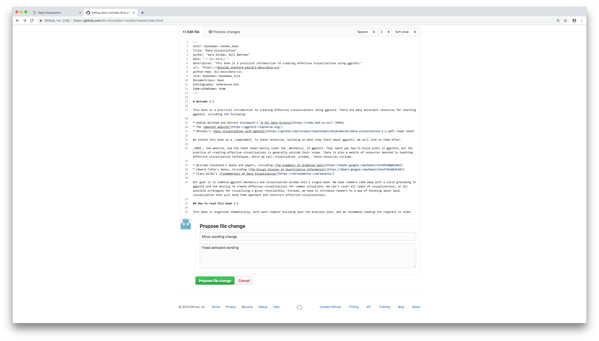
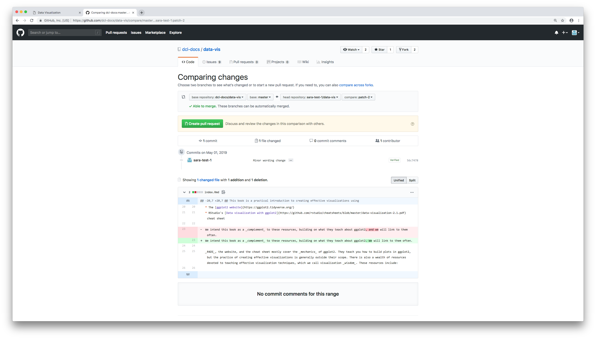
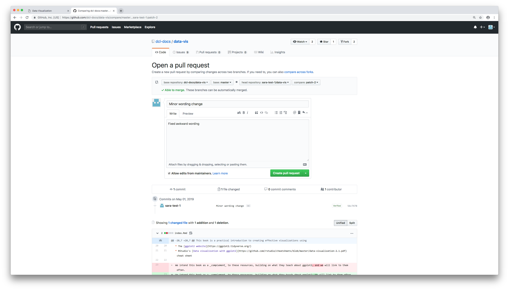
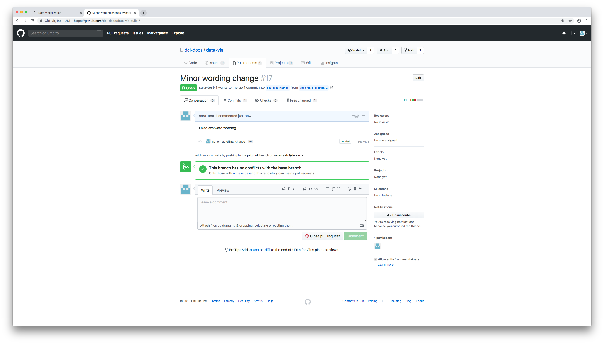
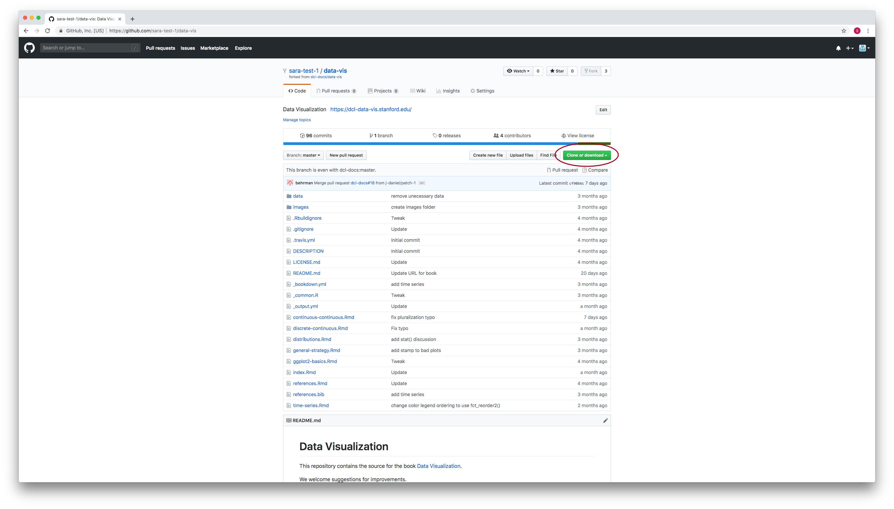

Pull requests
================

  - [Quick fixes to bookdown books](#quick-fixes-to-bookdown-books)
  - [Fork-and-branch workflow](#fork-and-branch-workflow)

DCL books and readings are on GitHub, and anyone can contribute and
suggest changes. To contribute to content or code that’s on GitHub,
you’ll need to:

  - Make your own copy of the repository, called a **fork**.
  - Edit the code or content in your fork.
  - Issue a **pull request** to tell the repository owners about your
    suggested changes.

We’ll walk you through two workflows for issuing pull requests. The
first involves very minimal work with git, since everything can be done
with on the GitHub website. You can use this workflow for any
[bookdown](https://bookdown.org/) book, like the [DCL
books](https://github.com/dcl-docs) and *R for Data Science*.

The second workflow is more general, but also more complicated. Use this
second workflow when:

  - Contributing to open-source packages like those in the tidyverse
  - Editing non-book DCL readings like the [Model evaluation
    reading](https://dcl-2019-04.github.io/curriculum/model-eval.html)
  - Making extensive or code-related edits to bookdown books

## Quick fixes to bookdown books

All the DCL books use bookdown. Bookdown has a feature that makes it
easy to make pull requests for small wording fixes like typos.

To use this feature, click on the pencil and paper icon in the top-left.
Note that you have to be on the page that you want to edit.

<!-- -->

You’ll be directed to GitHub, and asked to fork the repository. Click
*Fork this repository and propose changes*.

<!-- -->

Make your changes in the *Edit file* editor.

<!-- -->

Then, scroll down to the box titled *Propose file change*.

<!-- -->

Add a title and description to your proposed change.

<!-- -->

Then, click *Propose file change*.

You should now see page comparing your proposed changes to the original.
Click *Create pull request*.

<!-- -->

You’ll again have a change to edit your pull request title and
description.

<!-- -->

When you’re happy with your title and description, click *Create pull
request*.

If you see a page that looks like the following, you’re done\! Now, you
just wait to see if the repository owner accepts or rejects your pull
request.

<!-- -->

## Fork-and-branch workflow

The above strategy is only a good idea for small wording changes. If you
want to edit code, or make major written additions, you should use the
fork-and-branch workflow.

We’ll walk you through the process step-by-step.

### Fork the original repository

On the GitHub site, navigate to the repository where you want to suggest
a change. Click *Fork*.

<!-- -->

GitHub may ask you where you want to fork the repository. You will
likely want to fork it to your own personal account.

### Clone you fork

On your fork’s GitHub page, click *Clone or download* and then copy the
URL.

<!-- -->

Next, from the command line, navigate to the folder where you want your
fork to live. Then, clone your fork with

`git clone [url you copied]`.

You now have a fork with a single branch called *master*.

### Add a remote for the original repository

You cloned your fork, but you need to connect your clone with the
original repository.

First, copy the URL of the *original* repository. In our example, the
original repository is *dcl-docs/data-vis* and the URL is
<https://github.com/dcl-docs/data-vis.git>.

In the command line, run

`git remote add usptream [url of original repository]`

For example,

`git remote add upstream https://github.com/dcl-docs/data-vis.git`

Type `git remote` to see a list of all the remotes. You should have two
now: `origin` and `upstream`. `origin` refers to your fork. `upstream`
refers to the original repository.

### Create a new branch

You can always check which branch you’re currently on by running `git
branch`. Your current branch will be a different color and have a star
next to it.

Make sure you’re currently on the `master` branch. If you’re not, switch
to the master branch by running

`git checkout master`

Now, create a new branch. You’ll make your changes on this branch. Think
of a descriptive name for your branch that describes what file you’re
making changes to and what changes you’re making. For example, if you
found a typo in the *Time series* chapter of the Data Visualization
book, you might name your branch `time-series-fix-typo`.

Switch to a new branch by running

`git checkout -b [name-of-your-branch]`

For example,

`git checkout -b time-series-fix-typo`

You’ll now be on your new branch. You can double-check this by running

`git branch`

and noticing which branch is colored and has a star.

### Make changes in your branch

Once you’re on the correct branch, open up the file you want to make
changes to in RStudio and make your changes.

Then, add and commit your changes. The process is the same as that for
“normal”, non-forked / branched repositories.

`git add [file you made changes to]`

`git commit -m [message]`

### Push your changes

Pushing works a bit differently. Now, you have two remotes and multiple
branches. When you push, you need to specify your remote and your
branch.

You want to push to your fork, not the original repository. Recall that
this remote is called `origin`.

Run

`git push origin [name-of-your-branch]`

For example, if we fixed the typo in the *Time series* chapter on a
branch called `time-series-fix-typo`, we’d run

`git push origin time-series-fix-typo`

### Open a pull request

Right now, you’ve pushed your changes to your fork. If you navigate to
your fork on GitHub, you’ll see a record of those changes.

You still need to suggest those changes to the owner of the original
repository. You do this by opening a *pull request*.

When you pushed your changes from the command line, git should have
provided you with a link to make a pull request. Copy and paste this
link into your browser. You can also find this link on the GitHub page
of your fork.

Give your pull request a descriptive title and description, then click
*Create pull request*.

You’re done\!

### Sync your fork

It’s important to keep your fork in-sync with the original repository.
Before you make any other changes to your fork, get all the commits to
the upstream repository by running

`git fetch upstream`

Then, make sure you’re one your fork’s master branch. If you’re not (or
you just want to be safe), switch to the master branch by running

`git checkout master`

Finally, merge the upstream changes into your fork’s master branch with

`git merge upstream/master`

The master branch of your local fork will now have all the changes made
to the original copy of the repository. For example, if we updated
`data-vis` by adding a chapter or fixing some wording in
*time-series.Rmd*, you’ll now have those changes in your master branch.

### Checkout master and repeat

Now, say you want to make more changes to your fork and create some more
pull requests. You’ll want a new branch for each independent change that
you make. For example, say you just fixed a typo in *time\_series.Rmd*
and now want to fix a typo in *distributions.Rmd*. You’ll want a new
branch for the edits to *distributions.Rmd*.

Before you create a new branch, you need to make sure your currently on
the master branch. Otherwise, you’ll branch off your branches.

You want a tree that looks like this

<!-- -->

Not like this

<!-- -->

(Sometimes you’ll want the second kind of tree, just not in the cases
we’re talking about here.)

Recall that you run

`git checkout master`

to checkout the master branch. Then, create a new branch with

`git checkout -b [name of new branch]`

Now, to make another change, just repeat the steps starting with *Make
changes in your branch*.
