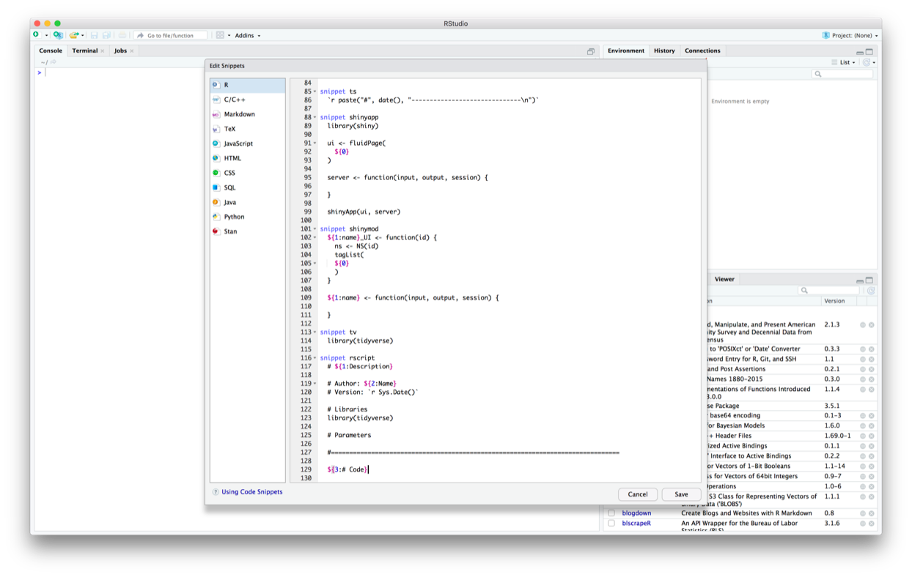

RStudio code snippets
================

In RStudio, **code snippets** are text macros that you can use to insert
bits of commonly used code. Here, we’ll walk you through the creation of
two snippets:

  - A snippet to add in `library(tidyverse)`
  - A snippet to start an R script

You can use the same process to create any snippet you want.

## `tv` snippet

  - Go to *RStudio* \> *Preferences* \> *Code*, and find the *Snippets*
    section.
  - Make sure *Enable code snippets* is checked.
  - Click on *Edit snippets*.

<!-- -->

  - Scroll down to the bottom of the snippet editor to add your snippet.
  - Paste in the following code to create a `library(tidyverse)` snippet
    named `tv`:

<!-- end list -->

    snippet tv
      library(tidyverse)

Note that every line after `snippet [snippet name]` must start with a
single tab.

<!-- -->

  - Click *Save* and exit the *Preferences* window.

Now, you can use your snippet. In the console, an RMarkdown document, or
an R script, type `tv` then hit tab. `library(tidyverse)` should appear.

## `rscript` snippet

We used a script template to create the scripts in our [example
project](https://github.com/dcl-docs/project-example). Each script has a
section for parameters and a section for code, separated by a line.
There are spots for the description, author, and version.

Here’s what the script template looks like:

``` r
# Description

# Author: Name
# Version: 2019-08-26

# Libraries
library(tidyverse)

# Parameters

#===============================================================================

# Code
```

Because the script template has elements for the user to fill in, the
`rscript` snippet is going to be more complicated than the `tv` snippet.

  - Follow the steps from the previous section to open the snippet
    editor.
  - Paste in the following code to create a snippet named `rscript`:

<!-- end list -->

    snippet rscript
        # ${1:Descriptio}
        
        # Author: ${2:Name}
        # Version: 2019-08-26
        
        # Libraries
        library(tidyverse)
        
        # Parameters
        
        # ============================================================================
        
        ${5:# Code}

<!-- -->

The `${}` components create variables. As you’ll see later, when you use
the snippet, you can tab through these variables to fill them in. The
numbers inside the `{}`s define the order in which you can tab through
them.

  - Click *Save* and exit the *Preferences* window.

Now, you can use your snippet.

  - Type `rscript` and then hit tab. The script template should appear.
  - Fill in your variables (if the snippet has any). You can tab to
    automatically move the cursor to the next variable.

<!-- -->

You shouldn’t have to type out `rscript` everytime you want to use the
snippet. If you type out a portion of `rscript`, the name of the snippet
should appear and you can hit tab to select the snippet.

<!-- -->
